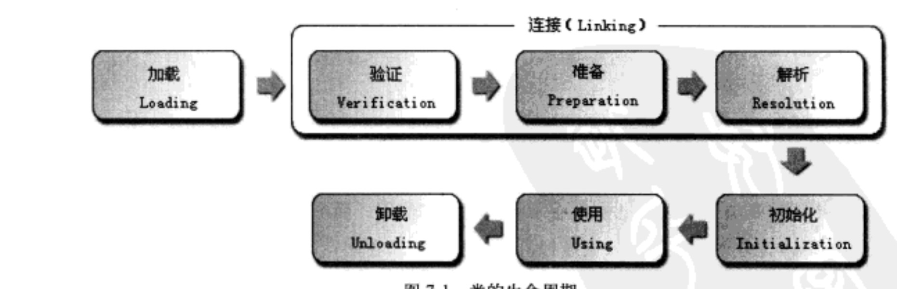
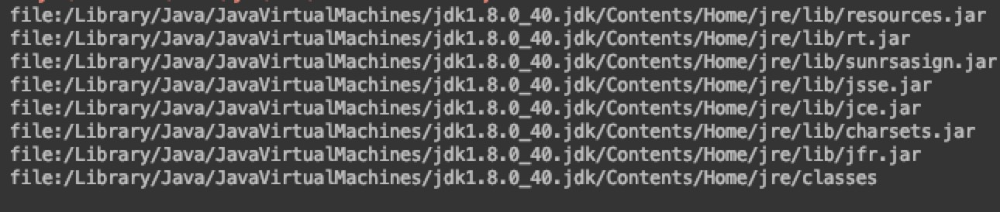
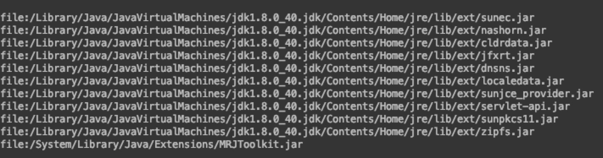
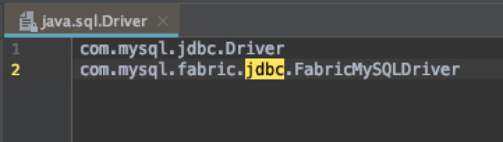

#  								类加载机制

## 一、工作流程

加载-->连接-->初始化-->使用-->卸载，其中连接由验证、准备、解析组成。加载、验证、准备、初始化、卸载顺序确定，**但是解析执行位置不确定，因为为了支持动态固定**

**Class.forName() 会把类加载进虚拟机，并把类初始化**

**ClassLoader.loadClass() 只会加载进虚拟机**

初始化类的时机

1. 通过new实例化对象
2. 读取或设置一个类的静态字段
3. 调用类的静态方法
4. 通过反射对类进行调用
5. 初始化一个类时发现其父类并未初始化，会初始化父类
6. 虚拟机启动时，执行的main()方法所在的类

不会初始化的情况

	1. 子类使用父类静态变量，此时只会初始化父类
	2. 通过数组引用类
	3. 使用静态final的变量，因为final变量会在编译期编译到常量池中，所以不会初始化

## 二、类加载器

### 1、类与类加载器

* 实现**通过类的权限定名获取描述此类的二进制字节流**这个动作的模块，叫做类加载器
* 确定两个类是否相同，需要判断其自身以及加载其的类加载器是否相同

### 2、双亲委派模型

 1. 类加载器分类

    ​	启动类加载器（BootStrap ClassLoader）：由C++实现，加载<JAVA_HOME>\lib目录中的类，核心类库

    ​	

    ​	扩展类加载器（Extension ClassLoader）：加载<JAVA_HOME>\lib\ext目录中的类

    

    ​	应用程序类加载器（APP ClassLoader）：加载用户类路径上的类库

    

    2. 双亲委派模型

    加载步骤：

    1. 查看当前类加载器缓存中是否已经存在了需要的类
    2. 委托父加载器请求相应名称的类
    3. 父加载器采用相同的策略，一直到没有父加载器（Bootstrap ClassLoader）
    4. 如果父加载器没有查找到，再自己进行查找，并在查找后放到缓存中

    

3. 双亲委派模型的优点
   

​		类加载器具备了优先级，加载Java的基础类（如java.lang.Object），都会委托给启动类加载器，使得Object类在程序中的各种加载器环境中都对应的是同一个类。
​    

4. 双亲委派模型的缺点
   

​		双亲委派模型使得越基础的类由越上层的类加载器进行加载，基础类是被用户代码调用的API。所以，如果基础类需要调用用户的代码，就会产生问题。
​    
​		比如JDBC需要加载相应数据库的驱动，就是基础类需要调用驱动类的代码，但是基础类的类加载器是不知道相应的驱动类，所以就引入了ContextClassLoader，即当前线程使用的ClassLoader。所以SPI机制会去读取META-INF/services/#{className}对应的文件，从而通过ContextClassLoader加载相应的类。SpringBoot也采用了相同的机制。
​    

​    

5. 通过类加载器进行热加载
   

​		因为不同ClassLoader加载的同一个类被认为是不同的类，所以可以通过自定义ClassLoader，当监听到旧的class文件被替换后，创建新的ClassLoader实例，并创建新类的实例，然后运行新的实例方法。
​    

​    
​    