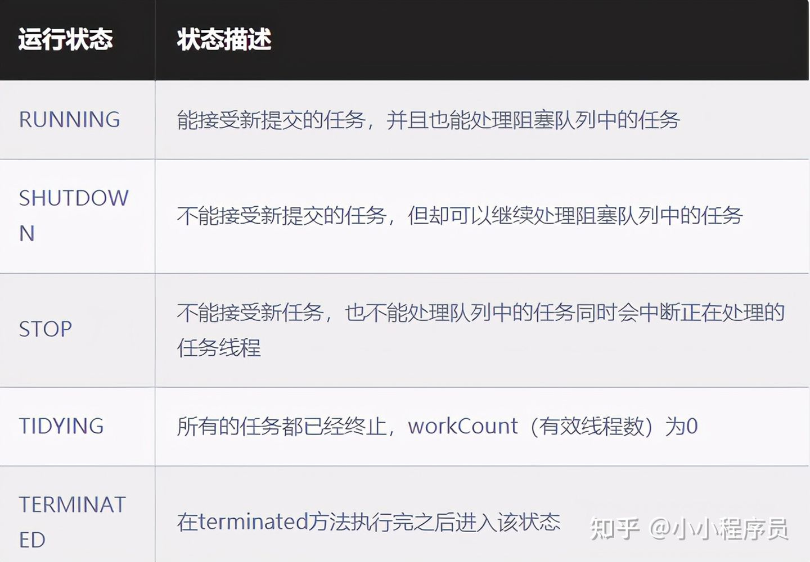
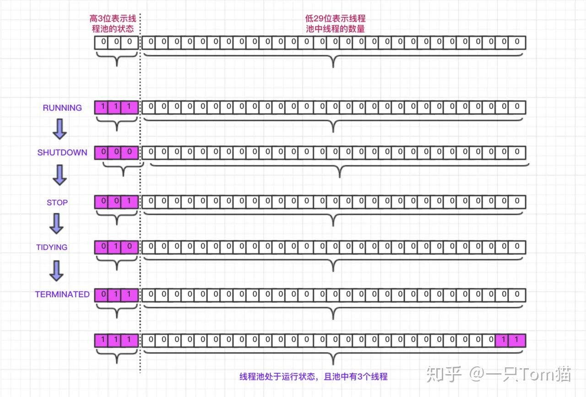
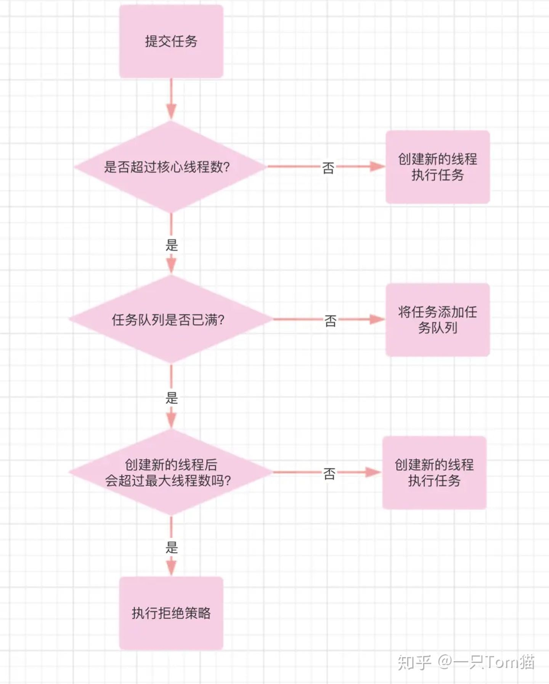

# 										线程池

## 一、介绍

### 1、用处

- 降低资源消耗

- 提高响应速度
- 提高线程的可管理性
- ........


### 2、构造函数

```java
public ThreadPoolExecutor(int corePoolSize,
                              int maximumPoolSize,
                              long keepAliveTime,
                              TimeUnit unit,
                              BlockingQueue<Runnable> workQueue,
                              ThreadFactory threadFactory,
                              RejectedExecutionHandler handler)
```

| 参数名          | 描述                                             |
| --------------- | ------------------------------------------------ |
| corePoolSize    | 核心线程数                                       |
| maximumPoolSize | 最大线程数                                       |
| keepAliveTime   | 当线程数超过核心线程数，那部分线程最大的存活时间 |
| unit            | 时间单位                                         |
| workQueue       | 储存任务的阻塞队列                               |
| threadFactory   | 线程创建工厂                                     |
| handler         | 当任务队列满了且达到最大线程数时使用的拒绝策略   |


### 3、状态

线程池状态有以下几种：



线程池的状态和当前线程数量由一个AtomicInteger储存，Integer的高3位为线程池状态，低29位为线程池线程数量。



<font color="red">为什么只是用一个变量表示状态：</font>**用一个变量去存储两个值，可避免在做相关决策时，出现不一致的情况，不必为了维护两者的一致，而占用锁资源。**

## 二、原理

### 1、执行任务流程

1. 线程数量小于核心线程数，直接创建线程并提交任务
2. 线程数量等于核心线程数，且任务队列未满，将提交任务放到阻塞队列中
3. 线程数量大于等于核心线程数，且小于最大线程数，创建非核心线程并提交任务



### 2、整体逻辑

线程池由生产者和消费者两部分组成，生产者为用户提交的任务，任务被储存在阻塞队列workQueue中；消费者为经过包装后的线程----Worker。由ThreadPoolExecutor的两个成员变量保存。

```java
//任务队列
private final BlockingQueue<Runnable> workQueue;
//工作线程集合
private final HashSet<Worker> workers = new HashSet<Worker>();

```


### 3、如何实现线程一直运行和线程销毁

所有线程实例通过worker存放在workers这个集合中，只要不从集合删除，就不会被销毁

对于每一个Worker对象，由一个初始任务、一个线程和完成任务数构成。线程在创建后会一直循环从阻塞队列中取任务，直到出现异常导致线程停止、线程池状态发生改变、队列为空。在循环中，线程会一直运行，不会销毁。

当线程获取不到任务，就会退出循环，从workers集合中被删除。**如果删除之后，线程数量小于核心线程数量，会再加上**

下面的代码为worker线程消费任务的代码

```java
 final void runWorker(Worker w) {
        Thread wt = Thread.currentThread();
        Runnable task = w.firstTask;//创建worker时的初始任务，如果worker为非核心线程，则为空
        w.firstTask = null;
        w.unlock(); //解锁，允许中断,AQS实现
        boolean completedAbruptly = true;//是否异常结束
        try {
            while (task != null || (task = getTask()) != null) {
                w.lock();//开始执行，上锁
               //如果当前的工作线程已经有执行任务，或者可以从等待队列中获取到执行任务
			        //getTask获取任务时候会进行阻塞
                if ((runStateAtLeast(ctl.get(), STOP) ||
                     (Thread.interrupted() &&
                      runStateAtLeast(ctl.get(), STOP))) &&
                    !wt.isInterrupted())
                    wt.interrupt();
                try {
                    beforeExecute(wt, task);
                    Throwable thrown = null;
                    try {
                        task.run();
                    } catch (RuntimeException x) {
                        thrown = x; throw x;
                    } catch (Error x) {
                        thrown = x; throw x;
                    } catch (Throwable x) {
                        thrown = x; throw new Error(x);
                    } finally {
                        afterExecute(task, thrown);
                    }
                } finally {
                   task = null;//工作线程的当前任务置空
                	 w.completedTasks++;//当前工作线程执行完成的线程数+1
	                 w.unlock();//执行完成解锁
                }
            }
            completedAbruptly = false;
        } finally {
            processWorkerExit(w, completedAbruptly);//回收线程、异常处理
        }
    }
```


下面的代码为worker线程获取任务的代码

```java
private Runnable getTask() {
        boolean timedOut = false; // Did the last poll() time out?

        for (;;) {
            int c = ctl.get();
            int rs = runStateOf(c);

            /**
         		* 1、rs为STOP\TIDYING\TERMINATED，标识无法继续执行任务
	          * 2、等待队列中没有任务可以被执行
   		      * 工作线程数量减一
      		   */
            if (rs >= SHUTDOWN && (rs >= STOP || workQueue.isEmpty())) {
                decrementWorkerCount();
                return null;
            }

            int wc = workerCountOf(c);

            // Are workers subject to culling?
            boolean timed = allowCoreThreadTimeOut || wc > corePoolSize;
						//经过上次循环，timedOut变为true，在此处返回null。
            if ((wc > maximumPoolSize || (timed && timedOut))
                && (wc > 1 || workQueue.isEmpty())) {
                if (compareAndDecrementWorkerCount(c))
                    return null;
                continue;
            }

            try {
              //判断超时的方式是从阻塞队列中poll是否超时
                Runnable r = timed ?
                    workQueue.poll(keepAliveTime, TimeUnit.NANOSECONDS) :
                    workQueue.take();
                if (r != null)
                    return r;
                timedOut = true;
            } catch (InterruptedException retry) {
                timedOut = false;
            }
        }
    }
```


线程执行结束，移除集合方便jvm销毁，根据线程数量判断是否要添加。

```java
private void processWorkerExit(Worker w, boolean completedAbruptly) {
    //completedAbruptly为true，标识该工作线程执行出现了异常，将工作线程数减一
    if (completedAbruptly) // If abrupt, then workerCount wasn't adjusted
        decrementWorkerCount();
    //否则标识该工作线程为正常结束，这种情况下getTask方法中已经对工作线程进行了减一
    final ReentrantLock mainLock = this.mainLock;
    mainLock.lock();//加锁
    try {
        completedTaskCount += w.completedTasks;//更新线程池的，线程执行完成数量
        workers.remove(w);//工作线程容器移除该工作线程
    } finally {
        mainLock.unlock();//解锁
    }
    //尝试结束线程池
    tryTerminate();
    int c = ctl.get();
    if (runStateLessThan(c, STOP)) {//如果当前线程池的运行状态是RUNNING\SHUTDOWN
        if (!completedAbruptly) {//如果该工作线程为正常结束
            /**
             * 判断当前需要的最少的核心线程数(如果允许核心线程超时，那么最小的核心线程数为0，否则为corePoolSize)
             */
            int min = allowCoreThreadTimeOut ? 0 : corePoolSize;
            //如果允许核心线程超时，而且等待队列不为空，那么工作线程的最小值为1，否则为0。
            if (min == 0 && ! workQueue.isEmpty())
                min = 1;
            //当前工作线程数，是否满足最先的核心线程数
            if (workerCountOf(c) >= min)
                //如果满足那么直接return
                return; // replacement not needed
        }
        //如果是异常结束，或者当前线程数不满足最小的核心线程数，那么添加一个非核心线程
        //核心线程和非核心线程没有什么不同，只是在创建的时候判断逻辑不同
        addWorker(null, false);
    }
}
```


### 


## 三、注意事项

### 1、为什么阿里巴巴Java规范中，禁用Executors创建线程池

- FixedThreadPool和SingleThreadExecutor => 允许的请求队列长度为Integer.MAX_VALUE，可能会堆积大量的请求，从而引起OOM异常
- CachedThreadPool => 允许创建的线程数为Integer.MAX_VALUE，可能会创建大量的线程，从而引起OOM异常

### 2、如何定义线程池参数

**CPU密集型 =>** 线程池的大小推荐为CPU数量 + 1，CPU数量可以根据Runtime.availableProcessors方法获取

**IO密集型 =>** CPU数量 * CPU利用率 * (1 + 线程等待时间/线程CPU时间)

**混合型 =>** 将任务分为CPU密集型和IO密集型，然后分别使用不同的线程池去处理，从而使每个线程池可以根据各自的工作负载来调整

**阻塞队列 =>** 推荐使用有界队列，有界队列有助于避免资源耗尽的情况发生

**拒绝策略 =>** 默认采用的是AbortPolicy拒绝策略，直接在程序中抛出RejectedExecutionException异常【因为是运行时异常，不强制catch】，这种处理方式不够优雅。处理拒绝策略有以下几种比较推荐：

- 在程序中捕获RejectedExecutionException异常，在捕获异常中对任务进行处理。针对默认拒绝策略
- 使用CallerRunsPolicy拒绝策略，该策略会将任务交给调用execute的线程执行【一般为主线程】，此时主线程将在一段时间内不能提交任何任务，从而使工作线程处理正在执行的任务。此时提交的线程将被保存在TCP队列中，TCP队列满将会影响客户端，这是一种平缓的性能降低
- 自定义拒绝策略，只需要实现RejectedExecutionHandler接口即可
- 如果任务不是特别重要，使用DiscardPolicy和DiscardOldestPolicy拒绝策略将任务丢弃也是可以的


## 四、引用

[美团技术文章--线程池](https://tech.meituan.com/2020/04/02/java-pooling-pratice-in-meituan.html)

[线程池源码分析](https://zhuanlan.zhihu.com/p/351657474)

