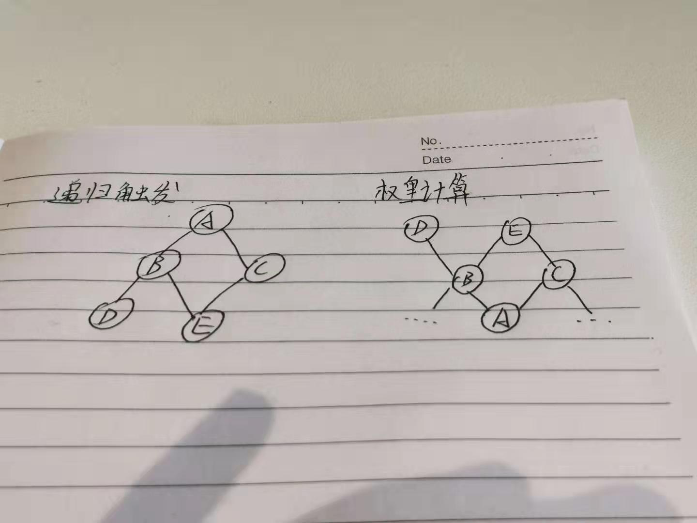

# 				计算任务拉取特性配置接口文档

我对照了RestApiConstants，只找到了以下的这些接口

<font color="red">**有的接口用的是"/channels/{channel_code}/traits/"这种方式，有的用的是"/channels/%s/traits/，查的时候要都查出来**"</font>

```
GET "/channels/{channel_code}/task/tasks/{task_type}"  根据特性状态获取任务列表

GET "/channels/{channel_code}/traits"  获取特性列表

GET "/channels/{channel_code}/updateable" //获取可更新特性列表

GET "/channels/{channel_code}/traits/trigger/all" 获取渠道内所有特性递归触发列表

GET "/channels/{channel_code}/traits/reference/all" 获取渠道内所有特性引用列表

POST "/channels/{channel_code}/traits/trigger/selected" 根据指定特性获取他们的递归触发列表

GET "/channels/{channel_code}/traits/opt-type/{opt_type}/status/{update_status}" 更新特性计算状态
```


# 名词解释

引用：一个**特性触发**(TraitTriggerTypeEnum.Trait_CHANGE)的特性，其策略中包含的所有特性，称为当前特性的引用。

触发：引用当前特性的所有特性的集合，称为当前特性的触发

递归触发：~~对当前特性及其触发进行递归计算，直到没有触发。所有触发特性的集合，为当前特性的递归触发。~~

权重：所有事件触发特性的权重为1；用户级别特性的权重为其引用的所有特性的权重总和再+1。权重越大，计算顺序越靠后，在接口五、六返回的顺序就越靠后。

```
		上面关于触发和递归触发这部分，我确实表述的不太明白，不过可能将一个特性的递归触发想象为一棵树更好理解。树的根节点为当前特性，每个节点的子节点为当前节点的触发，递归触发就是树上除了根节点的其他节点的集合；一个渠道内所有特性的触发，可以理解为事件触发特性递归触发的树的森林。
		
		对于计算权重，树的方向和上面说的触发方向是相反的，可以理解为渠道内特性触发的森林的倒置。在特性触发森林中，事件触发特性为根节点，而在计算权重时，事件触发特性为叶子节点。而所有事件触发特性的权重为1，不断地向上计算，直到计算到根节点。
		
		如下图左图，特性A是事件触发特性，BC是A的触发，BCDE是A的递归触发。A的更新触发了BC更新，BC的更新触发了DE的更新。而在权重计算上，A作为叶子节点，权重为1。不过需要注意的是，B和C的策略中有可能不止有A，计算时需要将策略中所有特性权重相加再加一。
		
		上面描述唯一有一点不太恰当的是，同一节点有可能有多个父节点，如图里的E和BC。而树是不该有多个父节点的。
```




## 一、拉取特性列表

**接口地址 :  /channels/{channelCode}/traits**

**方法：GET**

**参数列表：**

| 参数名称     | 传递方式     | 类型         | 说明                                   | 备注                                                        |
| ------------ | ------------ | ------------ | -------------------------------------- | ----------------------------------------------------------- |
| channel_code | PathVariable | String       | 渠道code                               |                                                             |
| trigger_type | RequestParam | List<String> | 触发类型，见TraitTriggerTypeEnum       | get请求参数，可以传多个。如trigger_type=trait&trigger=event |
| data_type    | RequestParam | String       | 请求哪种类型的特性特性。见DataTypeEnum |                                                             |

**返回值：**

排重特性列表


## 二、特性详情配置

<font color="red">这个接口应该是没有用上，在上面没有找到</font>

##### 接口地址：/channels/{channel_code}/traits/{trait_code}

##### 方法：GET

##### 参数列表

| 参数名称     | 传递方式     | 类型   | 说明     | 备注 |
| ------------ | ------------ | ------ | -------- | ---- |
| channel_code | PathVariable | String | 渠道code |      |
| trait_code   | RequestParam | String | 特性code |      |

##### 返回值

根据trait_code查出的特性


## 三、查出特性引用

##### 接口地址：/channels/{channel-code}/traits/reference/all

##### 方法：GET

##### 说明：查询出当前渠道内所有特性的引用。

##### 参数列表：

| 参数名称     | 传递方式     | 类型   | 说明     | 备注 |
| ------------ | ------------ | ------ | -------- | ---- |
| channel_code | PathVariable | String | 渠道code |      |

##### 返回值：Map<String, List<String>> key为traitCode，value为该特性引用的特性列表

##### 说明：该接口通过查询res_relation表查出当前渠道所有依赖，之后根据traitCode做groupBy，得到结果


## 四、查出特性递归触发

##### 接口地址：/channels/{channel-code}/traits/trigger/all

##### 方法：GET

##### 参数列表：

| 参数名称     | 传递方式     | 类型   | 说明     | 备注 |
| ------------ | ------------ | ------ | -------- | ---- |
| channel_code | PathVariable | String | 渠道code |      |

##### 返回值：Map<String,List<String>>  Key为特性code，value为排好序的触发特性。


## 五、查出给定特性code的递归触发

##### 接口地址：/channels/{channel-code}/traits/trigger/selected

##### 方法：POST（因为get的url中放不下那么长的参数）

##### 参数列表：

| 参数名称     | 传递方式     | 类型         | 说明     | 备注 |
| ------------ | ------------ | ------------ | -------- | ---- |
| channel_code | PathVariable | String       | 渠道code |      |
| select_code  | RequestBody  | List<String> | 指定code |      |

##### 返回值：List<String>  根据给定code，按照权重顺序排好序的特性code列表

##### 说明：查出的结果会包含入参中的select_code。如果没查到任何结果，会将select_code全部返回。


## 六、关于接口四、五查询的说明

查询步骤：

1. 查询出当前渠道的所有用户级别且激活的特性，及当前渠道的所有依赖，并将依赖分为触发集合和引用集合。
2. 遍历步骤1中的特性，通过引用关系，算出所有特性的权重，并将其缓存(见**TraitDependenceWeightService.calcWeightInChannel**)。在步骤1中，只计算出了触发集合，还需计算出递归的触发集合，并在之后将所有触发依赖合并（见**TraitDependenceWeightService.mergeTriggerTraits**）。
3. 根据所需结果不同，对数据进行不同的处理。接口四查询的是全渠道的数据，所以只要遍历步骤1中的所有特性，把他们依赖合并的结果根据权重进行排序即可；接口五查询的是给定数据按触发排序的列表，所以需遍历给定的数据，把他们步骤二计算出的触发依赖合并的结果再进行合并、按权重排序即可。


## 七、获取需要计算的特性列表

##### 接口地址：/channels/{channel_code}/traits/tasks/{task_type}

##### 方法：GET

##### 参数列表：

| 参数名称     | 传递方式     | 类型                 | 说明                             | 备注 |
| ------------ | ------------ | -------------------- | -------------------------------- | ---- |
| channel_code | PathVariable | String               | 渠道code                         |      |
| task_type    | PathVariable | RecalcOperationEnum  | 计算类型，清理、初始化           |      |
| trigger_type | RequestParam | TraitTriggerTypeEnum | 特性触发类型，事件触发、特性触发 |      |
| data_type    | RequestParam | DataTypeEnum         | 特性数据类型                     |      |

##### 返回值：根据条件，查询出的特性code列表。


## 八、更新计算状态

##### 接口地址：/channels/{channel_code}/traits/opt-type/{opt_type}/status/{update_status}

##### 方法：PUT

##### 参数列表：

| 参数名称      | 传递方式     | 类型                 | 说明                                   | 备注 |
| ------------- | ------------ | -------------------- | -------------------------------------- | ---- |
| channel_code  | PathVariable | String               | 渠道code                               |      |
| update_status | PathVariable | TaskResultStatusEnum | 更新结果（计算成功、计算中、计算失败） |      |
| opt_type      | PathVariable | RecalcOperationEnum  | 任务类型（初始化、清理）               |      |
| traitCodes    | RequestBody  | List<String>         | 批量更新的特性列表。数组形式           |      |

**返回值**：更新条数

##### 说明：

1. 所有的特性计算任务都会回调此接口，如果没有回调，认为仍处于上一个状态。即通过接口七进行查询的时候还能查询到。

2. 同时，如果更改的状态不是当前状态的下一个状态，也不会更改成功。

```
1. 比如当晚该计算的有A，B，C三个特性，计算任务通过需要接口七查询到A，B，C三个特性，但是只有A，B两个特性回调了接口八的开始计算。那么再次调用接口七，仍会查询到特性C。

2. 当A，B，C计算成功后，回调了接口八，但是接口八只会返回2，因为特性A，B的状态为计算中，而特性C的状态为准备计算，所以对于特性C的状态更改无法成功。
```


## 九、获取可更新特性列表

##### 接口地址：/channels/{channel_code}/traits/updateable

##### 请求方式：POST

参数列表

| 参数名称     | 传递方式     | 类型  | 说明     | 备注 |
| ------------ | ------------ | ----- | -------- | ---- |
| channel_code | PathVariable | Sting | 渠道code |      |

可更新特性：数字、字符串、是否、枚举、日期、地址、文本集合、标签类型的无策略的激活用户级别非跨渠道授权特性。