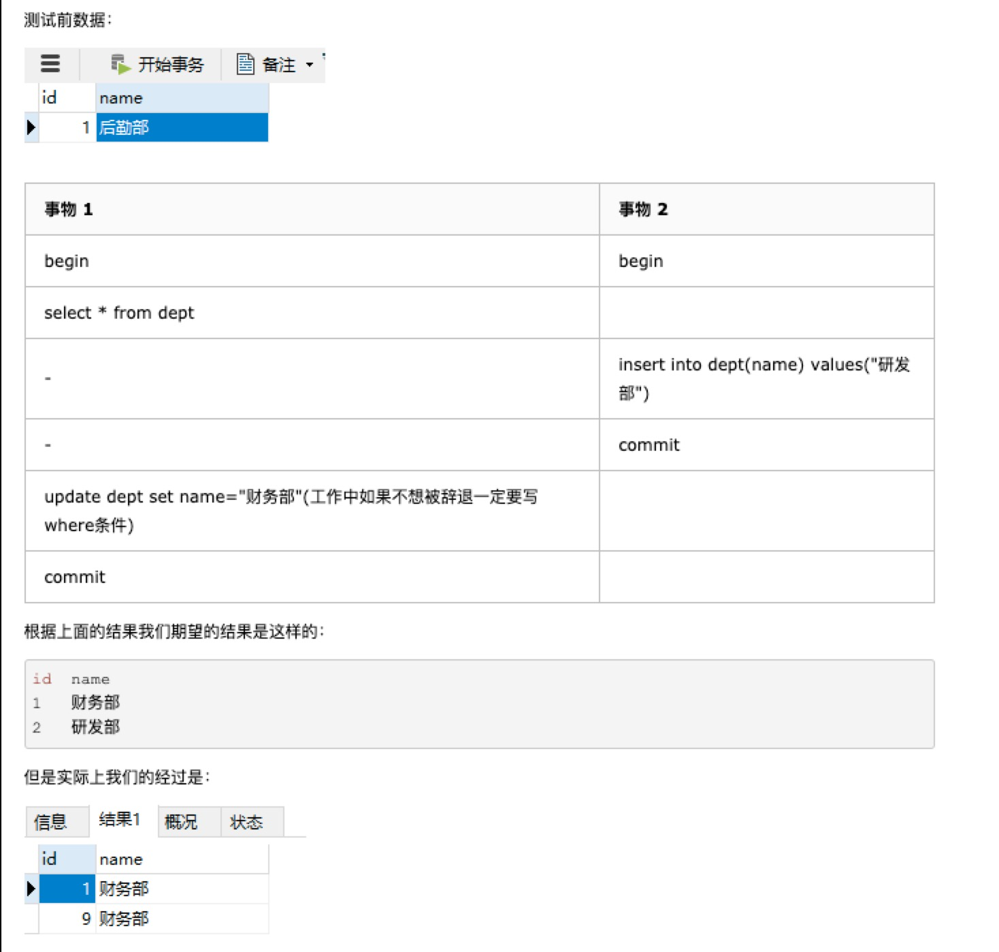

# 								事务

## 一、事务的四大特性

事务有四大特性ACID，A atom 原子性，C consistency 一致性，I isolation 隔离性，D durability 持久性


### 1、原子性

含义：一个事务为一个原子操作，要么事务内操作全部成功，要么全部失败。undo log保障了事务的原子性

### 2、持久性

含义：一旦事务提交，所做的更改就已经保存到数据库中。redo log保障了事务的一致性

### 3、隔离性

含义：事务所做的更改，在最终提交之前，别的事务是看不见的。具体和隔离级别相关。读写锁和MVCC保障了事务的隔离性。

隔离级别：

| 隔离级别                  | 脏读 | 不可重复读 | 幻读 | 备注 |
| ------------------------- | ---- | ---------- | ---- | ---- |
| 未提交读(read uncommited) | 是   | 是         | 是   |      |
| 已提交读(read commited)   | 否   | 是         | 是   |      |
| 可重复读(repeatable read) | 否   | 否         | 是   |      |
| 序列化(serializable)      | 否   | 否         | 否   |      |


#### 隔离性的实现：MVCC 多版本并发控制

系统版本号：一个递增数字，每开始一个事务，系统版本号会递增。

事务版本号：事务开始时会取当前系统版本号作为事务版本号

* 每一行数据有两个隐藏字段，创建版本号、删除版本号
* 创建一行数据时，将当前系统版本号作为创建版本号赋值
* 删除一行数据时，将当前系统版本号作为删除版本号赋值

select时读取数据的规则为：创建版本号<=当前事务版本号，删除版本号为空或>当前事务版本号。

insert时会为插入的行表示为当前版本号

delete时会将当前版本号更新到删除行的删除版本号

update时等于insert+delete

##### MVCC只是解决了读数据的幻读问题，但是对于写数据的幻读并没有解决


#### MVCC解决不了的幻读




#### 快照读与当前读

快照读：因为MVCC机制，实现了可重复读，所以读到的数据有可能为历史数据，而不是最新的。只要在同一事务内，没有对该表数据进行更新，所有数据都以快照为准。

当前读：读取数据库最新版本数据。如果两个事务一个进行了删除，一个进行了更新，就会产生冲突。

select可以进行当前读，需要手动加锁。


### 4、一致性

含义：关注于数据的可见性，只有初始状态和结束状态数据对外可见，中间状态不可见。事务使数据库从一个一致性状态变到另一个一致性状态。

在并发的状态下，原子性+隔离性+持久性实现了一致性。


## 二、事务锁定模式

### 1、锁的类型

* 共享锁：允许其他事务添加共享锁，不允许加排它锁。保证自身读到的数据是最新的。

* 排它锁：不允许其他事务添加任何锁，保证自身对当前数据的读写独占（如果只加共享锁，当别的事务对此行也加共享锁时，当前事务对此行无法更改）。

  * 共享锁与排它锁为行级锁

  * select默认为快照读，可以通过下面的语句显式添加锁，变为当前读。

    ```mysql
    select * from table where ? lock in share mode;/**共享锁**/
    select * from table where ? for update;/**排它锁**/
    ```

    

  * ***update/delete/insert***默认添加排它锁

* 意向共享锁：事务在取得一行的共享锁时，需先获得表的意向共享锁。

* 意向排它锁：事务在取得一行的排它锁时，需先取得表的意向排它锁。
  * 意向共享锁、意向排它锁为表级锁。
  * 意向锁之间互相不冲突。
  * 意向锁和其他的表锁冲突，避免表锁时进行聚簇索引的全表扫描。

* Next-key锁（GAP锁）：事务1进行两次相同的当前读，事务2在两次当前读中插入一条记录，在RC隔离级别下事务1的第二次读可以读到事务2的插入记录，也就是幻读。

  而在RR隔离级别中，加入了GAP锁，防止在某几条记录之中插入，避免了幻读，保证每次当前读返回的结果相同。

### 2、查询、更新时加锁过程

对于RR和RC的隔离级别，select进行的都是快照读，没有锁。

下面针对的是update/insert/delete

* 全表扫描

  ​		会给所有记录加排他锁，但是Mysql进行了优化，不符合条件的行锁会被释放，只锁符合条件的行。但是仍然会有加锁和解锁的过程。

* 主键

  ​		RR和RC效果相同，只在主键对应的行上排它锁。

* 唯一索引

  ​		RR和RC效果相同，在唯一索引处上排它锁，在主键对应的行上排它锁。

* 非唯一索引

  ​		RC时会在覆盖到的所有索引和主键对应的行上排它锁，RR在索引上还会加上GAP锁。

* 无索引

  ​		RC时会在主键对应的行上加排它锁，RR时会额外加GAP锁。

  

  [Mysql加锁过程解析](https://www.cnblogs.com/crazylqy/p/7611069.html)


## 三、Redo log和Undo log


* redo log记录已提交事务的修改信息，如果出现断电等情况，会根据事务是否完成来决定是否将redo log中的更改同步到数据库。redo log用来保障事务的持久性。
* undo log与redo log作用相反，用来记录事务中数据的逻辑变化，以便发生错误时进行回滚。undo log用来保障事务的原子性。

[redo log和undo log](https://juejin.im/post/5cb2e3b46fb9a0686e40c5cb)

