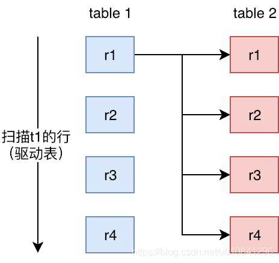
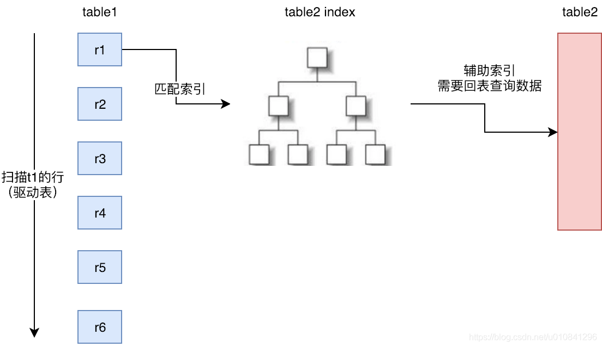
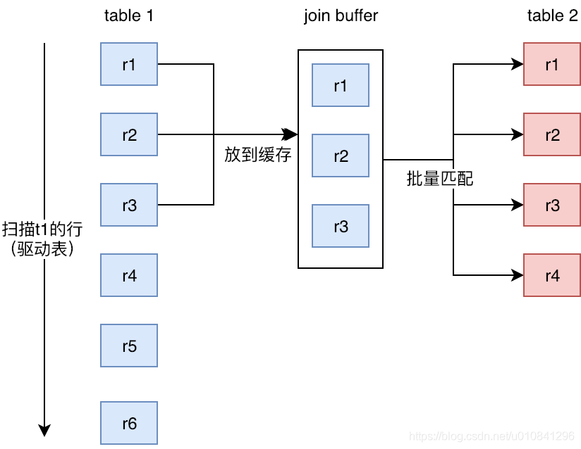

# 											联合查询

## 一、Nested-Loop Join

嵌套循环连接，是mysql中连接表的思想。

select * from t1 inner join t2 on t1.id=t2.tid
（1）t1称为外层表，也可称为驱动表。
（2）t2称为内层表，也可称为被驱动表。

伪代码如下：

```java
List<Row> result = new ArrayList<>();
for(Row r1 in List<Row> t1){
	for(Row r2 in List<Row> t2){
		if(r1.id = r2.tid){
			result.add(r1.join(r2));
		}
	}
}
```

基于Nested-Loop Join，又衍生了三种实现的算法

1. Simple Nested-Loop Join SNLJ
2. Index Nested-Loop Join INLJ
3. Block Nested-Loop Join BNLJ

## 二、Simple Nested-Loop Join

最简单粗暴的连接方式，将表一的每一行和表二的每一行一次去比较，时间复杂度为O(m*n)。

所以继续优化，在满足一定条件下，会使用INLJ或者BNLJ的方式



## 三、Index Nested-Loop Join

SNLJ的内层循环次数为被驱动表的行数，而INLJ则当被驱动表使用索引时，将实际的内层循环次数，从被驱动表的行数，优化为被驱动表索引B+Tree的高度。但是如果On语句中还有一些额外的条件，还需要通过索引进行回表查询。



## 四、Block Nested-Loop Join

1. 缓存块嵌套循环连接通过一次性缓存多条数据，把参与查询的列缓存到Join Buffer 里，然后拿join buffer里的数据批量与内层表的数据进行匹配，从而减少了内层循环的次数（遍历一次内层表就可以批量匹配一次Join Buffer里面的外层表数据）。
2. 当不使用Index Nested-Loop Join的时候，默认使用Block Nested-Loop Join。



## 五、如何优化Join速度

1. 用小结果集驱动大结果集，减少外层循环的数据量，从而减少内层循环次数：
   如果小结果集和大结果集连接的列都是索引列，mysql在内连接时也会选择用小结果集驱动大结果集，因为索引查询的成本是比较固定的，这时候外层的循环越少，join的速度便越快。
2. 为匹配的条件增加索引：争取使用INLJ，减少内层表的循环次数
3. **在使用outer join（right、left）时sql执行时，先进行On的匹配，再进行Where的匹配，所以**
4. 增大join buffer size的大小：当使用BNLJ时，一次缓存的数据越多，那么内层表循环的次数就越少
5. 减少不必要的字段查询：
   （1）当用到BNLJ时，字段越少，join buffer 所缓存的数据就越多，内层表的循环次数就越少；
   （2）当用到INLJ时，如果可以不回表查询，即利用到覆盖索引，则可能可以提示速度。（未经验证，只是一个推论）
