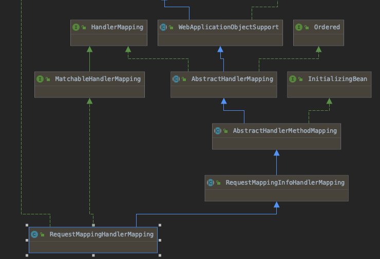
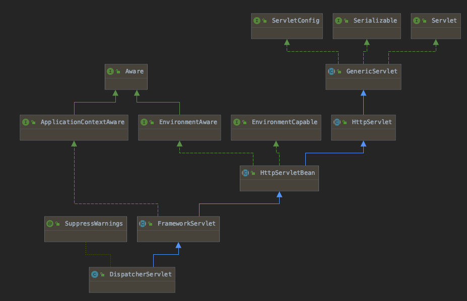

## 									Spring 访问请求

### 一、梗概

RequestMappingHandlerMapping是基于@RequestMapping解析出相应RequestMappingInfo，包含HttpMethod、RequestPath、MediaType等Http请求中的属性，并保存将RequestMappingInfo和url/BeanName/Class/Method的映射，以实现通过HttpServletRequest查找相应的类和方法。

下图为继承关系

### 二、实现方式

#### 1. 对@RequestMapping进行解析

​		从上图可以看到，RequestMappingHandlerMapping实现了InitializingBean接口，这个回调接口会在BeanFactory中所有对象实例化完毕且属性填充后进行调用。此时，AbstractHandlerMethodMapping会对BeanFactory中所有对象进行遍历，如果该对象被注解了@Controller或@RequestMapping，则会这个对象中所有方法进行遍历，将注解@RequestMapping的挑出来，解析为RequestMappingInfo，之后通过HTTPMethod、Url、MediaType进行查找。

#### 2. 将HandlerMapping储存到DispatcherServlet

上图是DispatcherServlet的继承关系，可以看出其继承了ApplicationContextAware接口，该接口会在属性填充完毕后，在InitializingBean.afterPropertiesSet()前调用。此时，DispatcherServlet会将BeanFactory中所有HandlerMapping类型的对象取出，存放为一个集合。集合中包含之前的RequestMappingHandlerMapping。

#### 3. 有请求时

1. 获取HandlerExecutionChain

   ​		DispatcherServlet遍历调用2中集合HandlerMapping.getHandler得到一个匹配的HandlerExecutionChain，HandlerExecutionChain可以理解为一个容器，其中包含了一个handler(对于RequestMappingHandler是HandlerMethod，其中包含调用方法、所属类）及一组匹配当前url的拦截器。

2. 获取HandlerAdapter

   ​		HandlerAdapter作为一个适配器，让DispatcherServlet不直接和HandlerMapping打交道，不会处理特定类型handler，从而方便扩展，每多一种类型的handler就要实现一个对应的HandlerAdapter。通过遍历dispatcherServlet的所有adapter，使用adapter.supports(handler)判断是否可以处理当前handler，可以的话，会使用当前adapter.handle(request,reponse,handler)进行下一步处理。

3. Adapter.handle()

   ​		抽象方法，对于RequestMappingHandlerMapping类型的handler，会调用adapter.handleInternal()，根据相应的handlerMethod调用到Controller的具体方法的，方法参数由request生成，并将返回值放置到response中。

   ​		

#### 4. servlet相关

[Spring如何结合Servlet]: https://stackify.com/spring-mvc/

#### 5、返回类型判断

//TODO

HandlerMethodReturnValueHandler